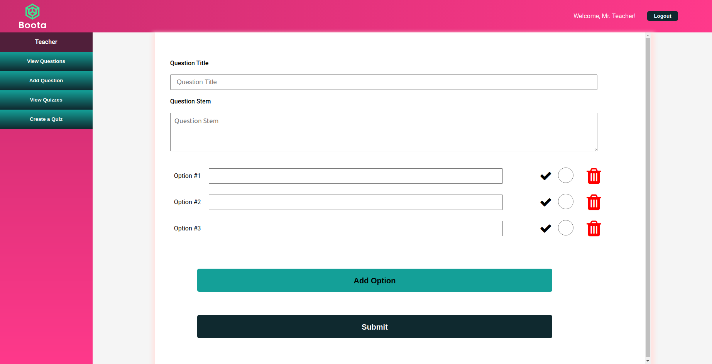
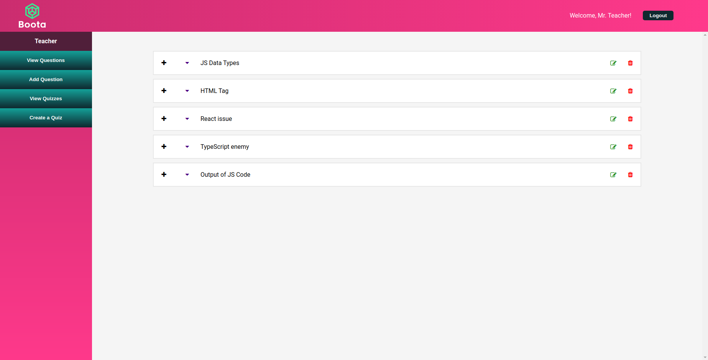
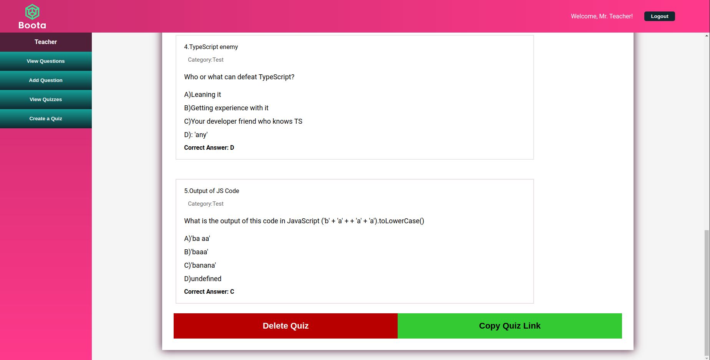

# Boota

  - [Introduction](#introduction)
  - [How does it work](#how-does-it-work)
  - [Getting Started](#getting-started)
  - [Known Issues](#known-issues)
  - [Links](#links)

### Introduction ###

Boota is an application that allows teachers to create question banks and generate quizzes out of these questions. Teachers can also share quizzes with students via a link, and students would be able to do the quiz and both teacher and student will receive a report card in the end with the student score.

### How does it work ###

After registering, you can log in as a teacher and you will be able to add questions clicking on the 'Add Question' tab

  

You will be able to see all the questions that you have created in the view questions menu

  

You can click the + sign on the view questions menu to add questions to a certain quiz. After you added all the questions you wanted to, you can submit a quiz clicking the Submit Quiz button at the quiz page.
After the quiz is submitted, its status will be changed to 'Submitted' and you will be able to copy the quiz link to you clipboard.

  

Now, share the link with your Student.

As the student, you will log in and paste the provided link in your browser. This will take you to the quiz page, where you can answer all the questions and submit them at the end. After a few seconds, you will receive a small report card with your score based on your % of correct answers.

The logic behind the final score is entirely made on the backend, no correct answers are provided on the client to make the application more secure.

  

The teacher will also be able to access your score on the View Quizzes menu, clicking on the Student Reports button.

### Getting Started ###

To get started, simply clone this and the client repo to your machine.
Change the environment variables using the .env.example as your guide.
For the server:

- Run npm install
- Run npm prestart (to build the app)
- Run npm start

### Known Issues ###

- Disabled password recovery as I am planning to change it from mailgun to nodemailer.
- Styling is not responsive yet.

## Links ##

Client repository: ...